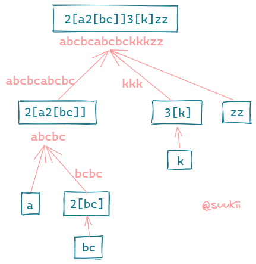
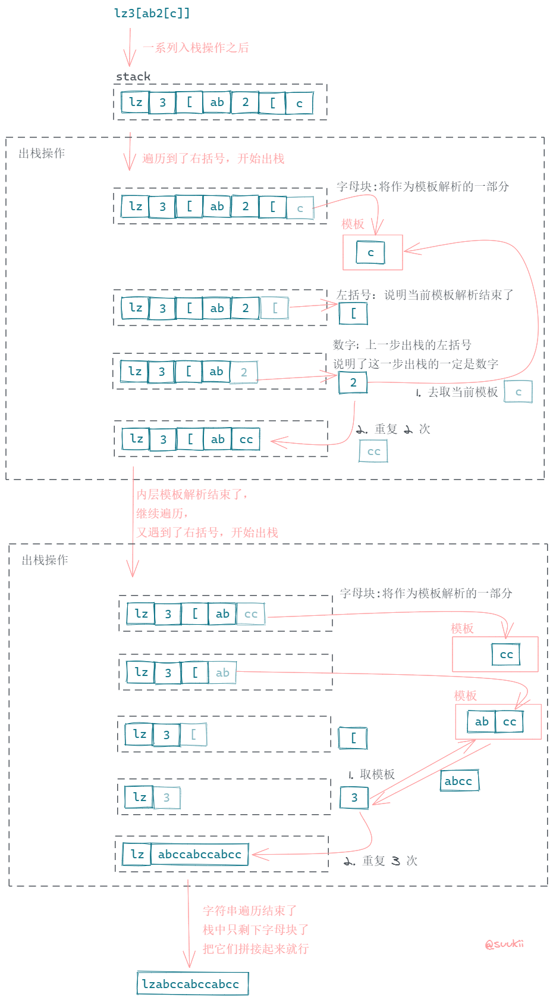

# 394.字符串解码

https://leetcode-cn.com/problems/decode-string/

## 题目描述

```
给定一个经过编码的字符串，返回它解码后的字符串。

编码规则为: k[encoded_string]，表示其中方括号内部的 encoded_string 正好重复 k 次。注意 k 保证为正整数。

你可以认为输入字符串总是有效的；输入字符串中没有额外的空格，且输入的方括号总是符合格式要求的。

此外，你可以认为原始数据不包含数字，所有的数字只表示重复的次数 k ，例如不会出现像 3a 或 2[4] 的输入。

示例:

s = "3[a]2[bc]", 返回 "aaabcbc".
s = "3[a2[c]]", 返回 "accaccacc".
s = "2[abc]3[cd]ef", 返回 "abcabccdcdcdef".

来源：力扣（LeetCode）
链接：https://leetcode-cn.com/problems/decode-string
著作权归领扣网络所有。商业转载请联系官方授权，非商业转载请注明出处。
```

## 递归

#### 图解

如果不理解题目的话可以看看。



#### 思路

`n[string]` 表示解析 `[]` 模板里面的内容，然后重复 `n` 次，即得到 n 个 string 拼接起来的字符串。

根据题意，`[]` 里面也是可以嵌套 `[]` 的，例如 `n[m[string]]`。这种情况下，我们得先解析最内层的模板，重复 `m` 次，然后将 `m * string` 的结果作为外层模板的解析内容，再重复 `n` 次。

如果嵌套的层数更多，我们也是得先找到最内层的 `[]`，就像洋葱一样，一层一层地剥开它的心，然后再从内到外一层层解析和拼接。这种描述很容易就让人想到了递归。

1. 我们先考虑括号是层层嵌套的情况，比如 `lz3[ab2[c]]`；
2. 开始遍历解析字符串，用一个变量 `decoded` 来保存模板解码的结果：

- 遇到字母，不需要解码，直接拼接到 `decoded`；
- 遇到数字，因为数字可能是多位，还需要一个变量 `count` 来记录，把数字拼接起来；
- 遇到左括号，说明紧跟着的是一个模板，递归获取这个模板的解析结果 (返回第 2 步，从当前左括号的下一位开始遍历字符串)，把递归结果重复 `count` 次并拼接到 `decoded`；
- 遇到右括号，说明当前模板的解析结束了，返回 `decoded`；

3. 由于字符串中可能存在多个平行的模板，比如 `3[ab]4[cd]`，所以我们还需要在递归外面加一个循环。注意每个模板解析结束后要返回当前的位置，下一次循环就从上一个模板之后开始解析。

#### 代码

```js
const type = {
  num: (n) => /^[0-9]+$/.test(n),
  alpha: (s) => /^[a-zA-Z]+$/.test(s),
  left: (c) => c === '[',
  right: (c) => c === ']'
}

/**
 * @param {string} s
 * @return {string}
 */
var decodeString = function (s, start = 0) {
  let count = '',
    decoded = '',
    i = start
  while (i < s.length) {
    let token = s[i]
    switch (true) {
      case type.num(token):
        count += token
        break
      case type.alpha(token):
        decoded += token
        break
      case type.left(token):
        const [pattern, k] = decodeString(s, i + 1)
        decoded += pattern.repeat(count)
        i = k
        count = ''
        break
      case type.right(token):
        return [decoded, i]
      default:
        break
    }
    i++
  }
  return decoded
}
```

## 循环 + 栈

可以用递归解决的问题，也可以用循环来解决。

这里我用了正则 `/[a-zA-Z]+|[0-9]+|\[|\]/` 和 `exec()` 方法来遍历字符串并把它们拆分成 `token`，比如，`lz3[ab2[c]]` 会被拆分成 `lz`, `3`, `[`, `ab`, `2`, `[`, `c`, `]`, `]`。

1. 遇到字母块 (`lz`)、数字时，入栈；
2. 遇到 `[` 时，入栈，用来标识当前进入一个模板解析了；
3. 遇到 `]` 时，说明当前模板遍历完了，我们可以开始解析了。开始出栈，把出栈的字母块都拼接起来，等出栈到 `[` 时，说明当前模板解析完成了。继续出栈一个元素，这个元素就是当前模板要重复的次数，把"字母块 \* 次数"后推入栈中。之所以要推入栈中是因为模板是可以嵌套的，当前模板的外层可以还是一个模板，所以我们要把结果放回去，继续解析外层的模板。

#### 图解过程



#### 代码

```js
/**
 * @param {string} s
 * @return {string}
 */
var decodeString = function (s) {
  const reg = /[a-zA-Z]+|[0-9]+|\[|\]/g
  const stack = []
  const peek = () => stack[stack.length - 1]

  while (reg.lastIndex < s.length) {
    let token = reg.exec(s)[0]
    if (token === ']') {
      // 遇到右括号就开始出栈
      let str = ''
      // [] 中间的就是要重复的模式，把它们拼接起来
      while (peek() !== '[') {
        str = stack.pop() + str
      }
      // 丢掉左括号
      stack.pop()
      // 左括号前面的一定是模式重复的次数
      const num = +stack.pop()
      // 把复制操作后的字符串放回栈中，作为外层 [] 模式的一部分
      stack.push(str.repeat(num))
    } else {
      // 数字，字母，左括号通通入栈
      stack.push(token)
    }
  }
  return stack.join('')
}
```

https://github.com/leetcode-pp/91alg-1/issues/20#issuecomment-638766214

**官方题解**

## 题目地址

### [394. 字符串解码](https://leetcode-cn.com/problems/decode-string/)

## 题目描述

给定一个经过编码的字符串，返回它解码后的字符串。

编码规则为: k[encoded_string]，表示其中方括号内部的 encoded_string 正好重复 k 次。注意 k 保证为正整数。

你可以认为输入字符串总是有效的；输入字符串中没有额外的空格，且输入的方括号总是符合格式要求的。

此外，你可以认为原始数据不包含数字，所有的数字只表示重复的次数 k ，例如不会出现像 3a 或 2[4] 的输入。

示例:

s = "3[a]2[bc]", 返回 "aaabcbc".
s = "3[a2[c]]", 返回 "accaccacc".
s = "2[abc]3[cd]ef", 返回 "abcabccdcdcdef".

## 前置知识

- 栈
- 括号匹配

## 思路

题目要求将一个经过编码的字符解码并返回解码后的字符串。
题目给定的条件是只有四种可能出现的字符

1. 字母
2. 数字
3. [
4. ]
   并且输入的方括号总是满足要求的（成对出现），数字只表示重复次数

那么根据以上条件，我们可以利用 stack 来实现这个操作

- 遍历这个字符串 s，判断每一个字符的类型
  -- 如果是字母 --> 添加到 stack 当中
  -- 如果是数字 --> 先不着急添加到 stack 中 --> 因为有可能有多位
  -- 如果是 [ --> 说明重复字符串开始 --> 将数字入栈 --> 并且将数字清零
  -- 如果是 ] --> 说明重复字符串结束 --> 将重复字符串重复前一步储存的数字遍

拿题目给的例子`s = "3[a2[c]]"` 来说：


在遇到 `】` 之前，我们不断执行压栈操作：


当遇到 `】`的时候，说明我们应该出栈了，不断出栈知道对应的`【`，这中间的就是 repeatStr。


但是要重复几次呢？ 我们需要继续出栈，直到非数字为止，这个数字我们记录为 repeatCount。


而最终的字符串就是 repeatCount 个 repeatStr 拼接的形式。 **并将其看成一个字母压入栈中**。


继续，后面的逻辑是一样的：


（最终图）

## 代码

JavaScript：

```js
/**

* @param {string} s

* @return {string}

*/

var decodeString = function (s) {
  var stack = []
  var factor = '' // repeat time
  for (let i = 0; i < s.length; i++) {
    var el = s[i]
    if (/[0-9]/.test(el)) {
      factor += el
    } else if (el === '[') {
      if (factor) {
        stack.push(factor - 0)
      }
      factor = ''
    } else if (el === ']') {
      var char = stack.pop()
      var str = ''
      while (typeof char !== 'number') {
        str = char + str // note: stack -> LIFO -> the string is reversed
        char = stack.pop()
      }
      stack.push(str.repeat(char))
    } else {
      stack.push(el)
    }
  }
  return stack.join('')
}
```

Python：

```py
class Solution:
    def decodeString(self, s: str) -> str:
        stack = []
        for c in s:
            if c == ']':
                repeatStr = ''
                repeatCount = ''
                while stack and stack[-1] != '[':
                    repeatStr = stack.pop() + repeatStr
                # pop 掉 "["
                stack.pop()
                while stack and stack[-1].isnumeric():
                    repeatCount = stack.pop() + repeatCount
                stack.append(repeatStr * int(repeatCount))
            else:
                stack.append(c)
        return "".join(stack)
```

**_复杂度分析_**

- 时间复杂度：$O(N)$，其中 N 为 s 长度。
- 空间复杂度：$O(N)$，其中 N 为 s 长度。

更多题解可以访问我的 LeetCode 题解仓库：https://github.com/azl397985856/leetcode 。 目前已经 30K star 啦。

大家也可以关注我的公众号《力扣加加》获取更多更新鲜的 LeetCode 题解


_Originally posted by @azl397985856 in https://github.com/leetcode-pp/91alg-1/issues/20#issuecomment-638800071_
