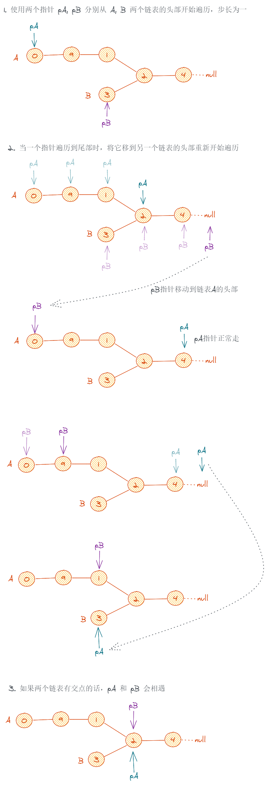
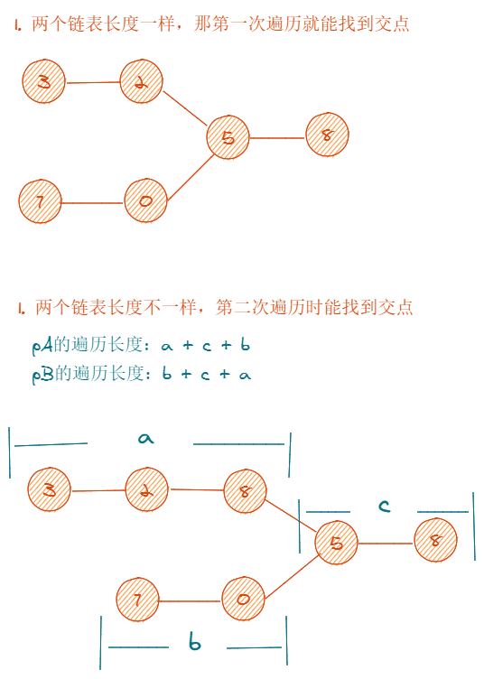

# 160.相交链表

## 题目描述

```
编写一个程序，找到两个单链表相交的起始节点。

https://leetcode-cn.com/problems/intersection-of-two-linked-lists
```

## 思路



**如果链表有交点**



**如果链表没有交点**

1. 两个链表长度一样，第一次遍历结束后 pA 和 pB 都是 null，结束遍历
2. 两个链表长度不一样，两次遍历结束后 pA 和 pB 都是 null，结束遍历

## 代码

```js
/**
 * Definition for singly-linked list.
 * function ListNode(val) {
 *     this.val = val;
 *     this.next = null;
 * }
 */

/**
 * @param {ListNode} headA
 * @param {ListNode} headB
 * @return {ListNode}
 */
var getIntersectionNode = function (headA, headB) {
  if (!headA || !headB) return null

  let pA = headA,
    pB = headB
  while (pA !== pB) {
    pA = pA === null ? headB : pA.next
    pB = pB === null ? headA : pB.next
  }
  return pA
}
```

_Originally posted by @suukii in https://github.com/leetcode-pp/91alg-1/issues/28#issuecomment-641733401_

**官方题解**

https://leetcode-cn.com/problems/intersection-of-two-linked-lists/solution/shuang-zhi-zhen-ha-xi-by-zstar01/
