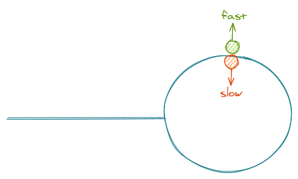
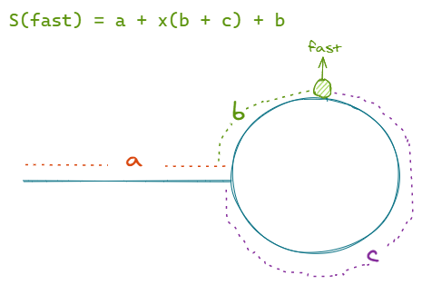
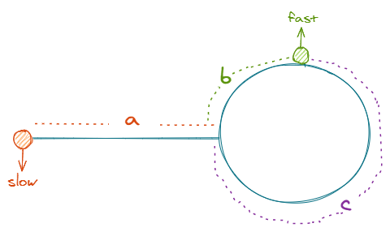
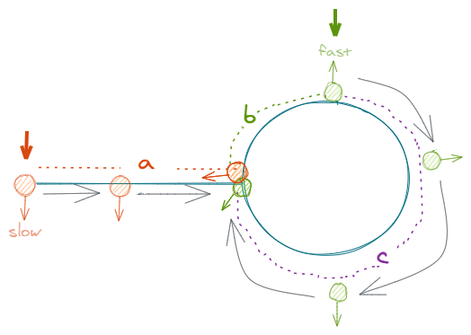

# 142.环形链表 II

https://leetcode-cn.com/problems/linked-list-cycle-ii/

## 题目描述

```
给定一个链表，返回链表开始入环的第一个节点。 如果链表无环，则返回 null。

为了表示给定链表中的环，我们使用整数 pos 来表示链表尾连接到链表中的位置（索引从 0 开始）。 如果 pos 是 -1，则在该链表中没有环。

说明：不允许修改给定的链表。

进阶：
你是否可以不用额外空间解决此题？

来源：力扣（LeetCode）
链接：https://leetcode-cn.com/problems/linked-list-cycle-ii
著作权归领扣网络所有。商业转载请联系官方授权，非商业转载请注明出处。
```

## 方法 1：使用额外空间来标记已遍历过的节点

#### 思路

1. 从头开始遍历链表并给每个节点增加一个“已遍历”的标记；
2. 如果在遍历过程中遇到了一个“已遍历”的节点，说明这个就是环的入口了；
3. 题目要求不允许修改给定的链表，但我们可以用一个 hashmap 来记录；
4. 由于题目中没有提到节点值是否唯一，也就是说两个不同的节点可能会有相同的值，那仅用节点值作为 hashmap 的 key 是不够的，得用整个节点对象来当 key，所以就想到了用 `Map`。

#### 复杂度分析

- 时间复杂度：O(n), n 为链表长度
- 空间复杂度：O(n)

#### 代码

JavaScript Code

```js
/**
 * Definition for singly-linked list.
 * function ListNode(val) {
 *     this.val = val;
 *     this.next = null;
 * }
 */

/**
 * @param {ListNode} head
 * @return {ListNode}
 */
var detectCycle = function (head) {
  const map = new Map()
  while (head) {
    map.set(head, head)
    head = head.next
    if (map.has(head)) {
      return head
    }
  }
  return null
}
```

## 方法 2

#### 思路

1. 先使用快慢指针确定链表是否有环；
2. 如果链表有环，那快慢指针相遇的点一定是在环内了；
3. 接着把一个指针 A 移到链表头部，另一个指针 B 留在环内；
4. 指针 A 开始遍历环外的节点，指针 A 每走一步，指针 B 在环内走一圈；
5. 如果指针 A 和指针 B 相遇了，说明这个节点就是环的入口。

> 因为环和环外的唯一交点就是环的入口点

#### 复杂度分析

- 时间复杂度：O(n\*p), n 是环外链表的长度，p 是环的长度。
- 空间复杂度：O(1)

#### 代码

Python Code

```py
# Definition for singly-linked list.
# class ListNode(object):
#     def __init__(self, x):
#         self.val = x
#         self.next = None

class Solution(object):
    def detectCycle(self, head):
        """
        :type head: ListNode
        :rtype: ListNode
        """
        slow = fast = head

        while slow != None and fast != None and fast.next != None:
            slow = slow.next
            fast = fast.next.next
            if slow == fast:
                return self.findConnection(head, slow)
        return None

    def findConnection(self, head, loopNode):
        p1 = head
        while True:
            p2 = loopNode
            while p2.next != loopNode and p2.next != p1:
                p2 = p2.next
            if p2.next == p1:
                return p1
            p1 = p1.next
```

## 方法 3

#### 思路

先用快慢指针确定链表有环，这里就不多说了，快慢指针相遇时，一定是在环内的某个节点。



我们分别来看一下两个指针相遇前分别走了多少路程。

**快指针**

假设走到相遇点之前，快指针在环内走了 x 圈，那快指针走过的总路程可以用 `S(fast) = a + x(b + c) + b` 来表示，其中 `(b + c)` 就是环的长度。



**慢指针**

假设走到相遇点之前，慢指针在环内走了 y 圈，同理可得慢指针走过的总路程是 `S(slow) = a + y(b + c) + b`。

而由于快指针的速度是慢指针速度的 2 倍，所以可得以下方程式：

`S(slow) = 2S(fast)` => `a + x(b + c) + b = 2(a + y(b + c) + b)`

稍微整理一下我们就得到了：

`a + b = (b + c)(x - 2y)`

如果我们把其中一个指针移动到链表头部，然后让两个指针以相同的速度移动。



它们会在环的入口相遇。



#### 复杂度分析

- 时间复杂度：O(n)
- 空间复杂度：O(1)

#### 代码

JavaScript Code

```js
/**
 * Definition for singly-linked list.
 * function ListNode(val) {
 *     this.val = val;
 *     this.next = null;
 * }
 */

/**
 * @param {ListNode} head
 * @return {ListNode}
 */
var detectCycle = function (head) {
  let fast = head,
    slow = head
  while (fast && fast.next) {
    fast = fast.next.next
    slow = slow.next

    if (fast === slow) {
      slow = head
      while (slow !== fast) {
        slow = slow.next
        fast = fast.next
      }
      return slow
    }
  }
  return null
}
```

**官方题解**

https://www.bilibili.com/video/BV11f4y127Se?pop_share=1
