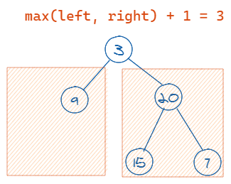
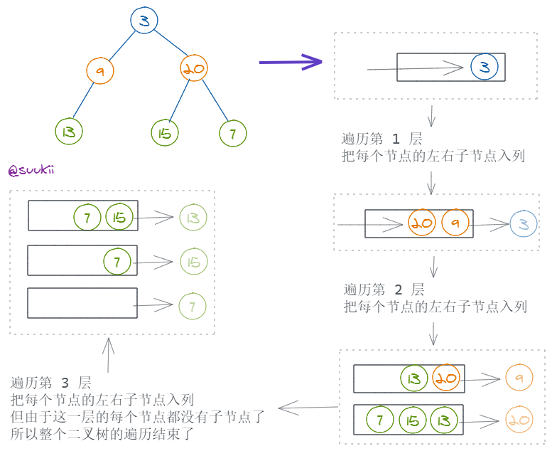

# 104.二叉树的最大深度

https://leetcode-cn.com/problems/maximum-depth-of-binary-tree/

## 题目描述

```
给定一个二叉树，找出其最大深度。

二叉树的深度为根节点到最远叶子节点的最长路径上的节点数。

说明: 叶子节点是指没有子节点的节点。

示例：
给定二叉树 [3,9,20,null,null,15,7]，

    3
   / \
  9  20
    /  \
   15   7
返回它的最大深度 3 。

来源：力扣（LeetCode）
链接：https://leetcode-cn.com/problems/maximum-depth-of-binary-tree
著作权归领扣网络所有。商业转载请联系官方授权，非商业转载请注明出处。
```

## 方法 1：递归

### 思路

递归地分别计算出左子树和右子树的高度，取最大值加一，就是当前二叉树的最大深度。



假设我们已经计算出了左子树的最大深度是 1，右子树的最大深度是 2，那整棵二叉树的的最大深度就是左右子树最大深度的最大值加上根节点，也就是 3。

接下来我们只需要递归地去计算左右子树的高度：

1. base condition: 首先在递归中很重要的事情就是找到递归的出口，在这道题目中，明显能想到的一个出口是，当遍历到叶子节点的时候：`if not root.left and not root.right`，这时候我们需要 `return 1`，还有一种情况是，当前遍历的节点为 `null`，这时候我们只需要 `return 0` 就好了。

2. 如果当前节点有左子树，递归计算左子树的高度 `leftHeight = maxDepth(root.left)`

3. 如果当前节点有右子树，递归计算右子树的高度 `rightHeight = maxDepth(root.right)`

4. 取左右子树最大高度的最大值，加上当前节点返回 `max(leftHeight, rightHeight) + 1`

### 复杂度分析

- 时间复杂度：O(N)，因为每个节点都只遍历一次。
- 空间复杂度：如果考虑递归调用函数占用的调用栈空间的话，空间复杂度应该是 O(N)，不考虑的话就是 O(1)，因为没有用到额外的空间。

### 代码

JavaScript Code

```js
/**
 * Definition for a binary tree node.
 * function TreeNode(val) {
 *     this.val = val;
 *     this.left = this.right = null;
 * }
 */
/**
 * @param {TreeNode} root
 * @return {number}
 */
var maxDepth = function (root) {
  if (!root) return 0
  return Math.max(maxDepth(root.left), maxDepth(root.right)) + 1
}
```

Python Code

```py
# Definition for a binary tree node.
# class TreeNode(object):
#     def __init__(self, x):
#         self.val = x
#         self.left = None
#         self.right = None

class Solution(object):
    def maxDepth(self, root):
        """
        :type root: TreeNode
        :rtype: int
        """
        if not root: return 0
        return max(self.maxDepth(root.left), self.maxDepth(root.right)) + 1
```

## 方法 2：循环+栈

### 思路

我们还可以用层级遍历的方法来找到二叉树的最大高度，一层层地遍历二叉树，每遍历一层，`height` 加一。

1. 记录当前这一层有多少个节点 `nodeCount`，当 `nodeCount` 等于 0 的时候，当前层遍历结束，`height++`，继续遍历下一层；
2. 当下一层的节点数为 0 的时候，停止遍历，返回 `height`；



### 复杂度分析

- 时间复杂度：O(N)，因为每个节点都分别入列出列一次，入列和出列操作的时间复杂度都是 O(1)，所以总的时间复杂度是 O(2N)，也就是 O(N)。
- 空间复杂度：O(h)，h 为树的高度，最坏的情况下树是完全二叉树。

### 伪代码

```
新建一个队列来存放遍历的节点
把 root 推入队列
初始化 height 为 0

重复以下步骤：
  记录当前层级的节点数 nodeCount (即队列中的节点数)

  if nodeCount === 0: return height // 二叉树遍历结束
  height++

  // 遍历当前层级的每个节点
  while nodeCount > 0:
    出列一个节点，将它的左右子节点入列
    nodeCount--
  // 当前层级遍历结束，此时队列中的是下一层的节点
```

### 代码

JavaScript Code

```js
/**
 * Definition for a binary tree node.
 * function TreeNode(val) {
 *     this.val = val;
 *     this.left = this.right = null;
 * }
 */
/**
 * @param {TreeNode} root
 * @return {number}
 */
var maxDepth = function (root) {
  const queue = []
  root && queue.push(root)
  let height = 0

  while (true) {
    let nodeCount = queue.length
    if (nodeCount === 0) return height
    height++

    while (nodeCount > 0) {
      const node = queue.shift()
      node.left && queue.push(node.left)
      node.right && queue.push(node.right)
      nodeCount--
    }
  }
}
```

Python Code

```py
# Definition for a binary tree node.
# class TreeNode(object):
#     def __init__(self, x):
#         self.val = x
#         self.left = None
#         self.right = None

class Solution(object):
    def maxDepth(self, root):
        """
        :type root: TreeNode
        :rtype: int
        """
        queue = []
        if root is not None: queue.append(root)
        height = 0

        while True:
            nodeCount = len(queue)
            if nodeCount == 0: return height
            height += 1

            while nodeCount > 0:
                node = queue.pop(0)
                if node.left is not None: queue.append(node.left)
                if node.right is not None: queue.append(node.right)
                nodeCount -= 1
```

_Originally posted by @suukii in https://github.com/leetcode-pp/91alg-1/issues/32#issuecomment-643574983_

**官方题解**

## 前置知识

- 递归

## 思路

树的题目很适合用来递归来做。 基本上和树的搜索有关的，都可以用递归来做，为什么？

因为树是一种递归的数据结构。而穷举搜索一棵树必然需要遍历其所有节点，而搜索的逻辑对所有的子树都是一样的。因此这就很适合用递归来解决了。

这里给大家介绍一种写递归的小方法 **产品经理法**。

1. 定义函数功能，不用管其具体实现。

从高层次的角度来定义函数功能。 你可以把自己想象成**产品经理**。只需要知道要做什么事情就行了，而怎么实现我不管，那是码农的事情。

具体来说，我需要的功能是**给定一个二叉树的节点，返回以这个节点为根节点的子树的最大深度**。假设这个函数为 f。那么问题转化为 f(root)。

2. 确定大问题和小问题的关系。

要解决 f(root) 这个问题。可以先解决 f(root.right) 和 f(root.left)，当然我们仍然不关心 f 怎么实现。

f(root) 与 f(root.right) 和 f(root.left) 有什么关系呢？ 不难看出 `1 + max(f(root.right), f(root.left))`。

到这里我们还不知道 f 怎么实现的，但是我们已经完成了产品经理的需求。

> 实际上我们知道了，我们怎么知道的？

3. 补充递归终止条件。

如果递归到叶子节点的时候，返回 0 即可。

## 代码（Python）

```py
# Definition for a binary tree node.
class Solution:
    def maxDepth(self, root: TreeNode) -> int:
        if not root: return 0
        return 1 + max(self.maxDepth(root.left), self.maxDepth(root.right))
```

**_复杂度分析_**

- 时间复杂度：$O(N)$，其中 N 为节点数。
- 空间复杂度：$O(h)$，其中 $h$ 为树的深度，最坏的情况 $h$ 等于 $N$，其中 N 为节点数，此时树退化到链表。

更多题解可以访问我的 LeetCode 题解仓库：https://github.com/azl397985856/leetcode 。 目前已经 30K star 啦。

大家也可以关注我的公众号《力扣加加》获取更多更新鲜的 LeetCode 题解


_Originally posted by @azl397985856 in https://github.com/leetcode-pp/91alg-1/issues/32#issuecomment-643620727_
