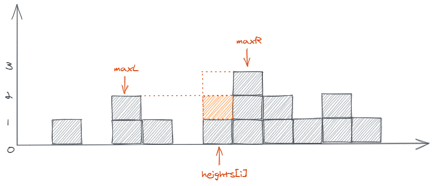

# 42.接雨水

https://leetcode-cn.com/problems/binary-tree-maximum-path-sum

## 题目描述

```
给定 n 个非负整数表示每个宽度为 1 的柱子的高度图，计算按此排列的柱子，下雨之后能接多少雨水。


上面是由数组 [0,1,0,2,1,0,1,3,2,1,2,1] 表示的高度图，在这种情况下，可以接 6 个单位的雨水（蓝色部分表示雨水）。 感谢 Marcos 贡献此图。

示例:

输入: [0,1,0,2,1,0,1,3,2,1,2,1]
输出: 6

来源：力扣（LeetCode）
链接：https://leetcode-cn.com/problems/trapping-rain-water
著作权归领扣网络所有。商业转载请联系官方授权，非商业转载请注明出处。
```

## 方法 1

### 思路

如果一根柱子的左右两边有比它高的柱子的话，那这根柱子的位置就可以储存雨水，所以问题可以细化成，**每根柱子所在的位置可以储存多少雨水**。要求这个问题的答案，只需分别找到这根柱子左右两侧出现的最高的柱子，取两者中较短的那根，减去当前柱子的高度，就是这个位置所能储存的雨水量了。



### 复杂度分析

- 时间复杂度：O(N^2)，N 为数组长度，遍历数组求每根柱子的位置所能储存的雨水量是 O(N)，对于每根柱子，要分别向左和向右遍历找出最高的柱子，时间复杂度是 O(N)，所以总的时间复杂度是 O(N^2)。
- 空间复杂度：O(1)。

### 代码

JavaScript Code

```js
/**
 * @param {number[]} heights
 * @return {number}
 */
var trap = function (heights) {
  const findMax = (heights, left, right) => {
    let max = 0
    for (let i = left; i <= right; i++) {
      heights[i] > max && (max = heights[i])
    }
    return max
  }

  let water = 0
  for (let i = 1, len = heights.length; i < len - 1; i++) {
    const maxL = findMax(heights, 0, i - 1)
    const maxR = findMax(heights, i + 1, len - 1)

    if (maxL > 0 && maxR > 0) {
      const unit = Math.min(maxR, maxL) - heights[i]
      water += unit > 0 ? unit : 0
    }
  }
  return water
}
```

## 方法 2

### 思路

方法 1 中，要找到某根柱子左右两边最高的柱子，每次都要重新遍历一次数组，时间复杂度太高了；可以优化一下，先遍历数组，记录下每根柱子左右最高的柱子分别是哪根。

### 复杂度分析

- 时间复杂度：O(N)，N 为数组长度，遍历一遍记录每根柱子左侧的最高柱子为 O(N)，遍历一遍记录每根柱子右侧的最高柱子为 O(N)，遍历一遍计算每根柱子位置能储存的雨水量为 O(N)，即 O(3N)，忽略常数，也就是 O(N)。
- 空间复杂度：O(N)，N 为数组长度，使用了两个数组来记录左右侧最高柱子，空间复杂度提高到了 O(N)。

### 代码

```js
/**
 * @param {number[]} heights
 * @return {number}
 */
var trap = function (heights) {
  const len = heights.length
  const maxL = Array(len).fill(0)
  const maxR = Array(len).fill(0)

  maxL[0] = heights[0]
  for (let i = 1; i < len; i++) {
    maxL[i] = Math.max(maxL[i - 1], heights[i])
  }

  maxR[len - 1] = heights[len - 1]
  for (let i = len - 2; i > 0; i--) {
    maxR[i] = Math.max(maxR[i + 1], heights[i])
  }

  let water = 0
  for (let i = 1; i < len - 1; i++) {
    const unit = Math.min(maxR[i], maxL[i]) - heights[i]
    unit > 0 && (water += unit)
  }
  return water
}
```

## 方法 3

### 思路

方法 2 使用了两个数组来记录左右侧的最高柱子，实际上，我们可以改用两个指针来记录，因为在计算雨水量的时候，我们只关心左右侧最高柱子中较短的那根，具体做法如下。

### 伪代码

```
使 low 指针指向数组开头，high 指针指向数组末尾；
定义 maxL 和 maxR 分别记录当前左右侧最高的柱子；

开始遍历数组，当 low <= high 时重复以下步骤：
    如果 low 柱子低于 high 柱子：
        如果 low 柱子高于 maxL：
            // low 柱子储存不了雨水，更新 maxL
            maxL = heights[low]
        否则：
            雨水量 += maxL - heights[low]
        low++
    否则：
        如果 high 柱子高于 maxR：
            // high 柱子储存不了雨水
            maxR = heights[high]
        否则：
            雨水量 += maxR - heights[high]
        high--

return 雨水量
```

### 复杂度分析

- 时间复杂度：O(N)，N 为数组长度。
- 空间复杂度：O(1)。

### 代码

JavaScript Code

```js
/**
 * @param {number[]} heights
 * @return {number}
 */
var trap = function (heights) {
  let water = 0,
    low = 0,
    high = heights.length - 1,
    maxL = 0,
    maxR = 0

  while (low <= high) {
    if (heights[low] < heights[high]) {
      if (heights[low] > maxL) {
        maxL = heights[low]
      } else {
        water += maxL - heights[low]
      }
      low++
    } else {
      if (heights[high] > maxR) {
        maxR = heights[high]
      } else {
        water += maxR - heights[high]
      }
      high--
    }
  }

  return water
}
```

**官方题解**

## 题目地址

https://leetcode.com/problems/trapping-rain-water/description/

## 题目描述

```
Given n non-negative integers representing an elevation map where the width of each bar is 1, compute how much water it is able to trap after raining.


The above elevation map is represented by array [0,1,0,2,1,0,1,3,2,1,2,1]. In this case, 6 units of rain water (blue section) are being trapped. Thanks Marcos for contributing this image!


```


```
Example:

Input: [0,1,0,2,1,0,1,3,2,1,2,1]
Output: 6

```

## 前置知识

- 空间换时间
- 双指针
- 单调栈

## 双数组

### 思路

这是一道雨水收集的问题， 难度为`hard`. 如图所示，让我们求下过雨之后最多可以积攒多少的水。

如果采用暴力求解的话，思路应该是 height 数组依次求和，然后相加。

伪代码:

```js
for (let i = 0; i < height.length; i++) {
  area += (h[i] - height[i]) * 1 // h为下雨之后的水位
}
```

问题转化为求 h，那么 h[i]又等于`左右两侧柱子的最大值中的较小值`，即
`h[i] = Math.min(左边柱子最大值, 右边柱子最大值)`

如上图那么 h 为 [0, 1, 1, 2, 2, 2 ,2, 3, 2, 2, 2, 1]

问题的关键在于求解`左边柱子最大值`和`右边柱子最大值`,
我们其实可以用两个数组来表示`leftMax`, `rightMax`，
以 leftMax 为例，leftMax[i]代表 i 的左侧柱子的最大值，因此我们维护两个数组即可。

### 关键点解析

- 建模 `h[i] = Math.min(左边柱子最大值, 右边柱子最大值)`(h 为下雨之后的水位)

### 代码

代码支持 JavaScript，Python3，C++:

JavaScript Code:

```js
/*
 * @lc app=leetcode id=42 lang=javascript
 *
 * [42] Trapping Rain Water
 *
 */
/**
 * @param {number[]} height
 * @return {number}
 */
var trap = function (height) {
  let max = 0
  let volumn = 0
  const leftMax = []
  const rightMax = []

  for (let i = 0; i < height.length; i++) {
    leftMax[i] = max = Math.max(height[i], max)
  }

  max = 0

  for (let i = height.length - 1; i >= 0; i--) {
    rightMax[i] = max = Math.max(height[i], max)
  }

  for (let i = 0; i < height.length; i++) {
    volumn = volumn + Math.min(leftMax[i], rightMax[i]) - height[i]
  }

  return volumn
}
```

Python Code:

```python
class Solution:
    def trap(self, heights: List[int]) -> int:
        n = len(heights)
        l, r = [0] * (n + 1), [0] * (n + 1)
        ans = 0
        for i in range(1, len(heights) + 1):
            l[i] = max(l[i - 1], heights[i - 1])
        for i in range(len(heights) - 1, 0, -1):
            r[i] = max(r[i + 1], heights[i])
        for i in range(len(heights)):
            ans += max(0, min(l[i + 1], r[i]) - heights[i])
        return ans
```

C++ Code:

```c++
int trap(vector<int>& heights)
{
	if(heights == null)
		return 0;
    int ans = 0;
    int size = heights.size();
    vector<int> left_max(size), right_max(size);
    left_max[0] = heights[0];
    for (int i = 1; i < size; i++) {
        left_max[i] = max(heights[i], left_max[i - 1]);
    }
    right_max[size - 1] = heights[size - 1];
    for (int i = size - 2; i >= 0; i--) {
        right_max[i] = max(heights[i], right_max[i + 1]);
    }
    for (int i = 1; i < size - 1; i++) {
        ans += min(left_max[i], right_max[i]) - heights[i];
    }
    return ans;
}

```

**复杂度分析**

- 时间复杂度：$O(N)$
- 空间复杂度：$O(N)$

## 双指针

### 思路

上面代码比较好理解，但是需要额外的 \${N} 的空间。从上面解法可以看出，我们实际上只关心左右两侧较小的那一个，并不需要两者都计算出来。具体来说：

- 如果 l[i + 1] < r[i] 那么 最终积水的高度由 i 的左侧最大值决定。
- 如果 l[i + 1] >= r[i] 那么 最终积水的高度由 i 的右侧最大值决定。

因此我们不必维护完整的两个数组，而是可以只进行一次遍历，同时维护左侧最大值和右侧最大值，使用常数变量完成即可。这是一个典型的双指针问题，

具体算法：

1. 维护两个指针 left 和 right，分别指向头尾。
2. 初始化左侧和右侧最低的高度都为 0。
3. 比较 height[left] 和 height[right]

   - 3.1 如果 height[left] < height[right]
     - 3.1.1 如果 height[left] >= left_max， 则当前格子积水面积为(left_max - height[left])
     - 3.1.2 否则无法积水，即积水面积为 0
   - 3.2 左指针右移一位

   - 3.3 如果 height[left] >= height[right]
     - 3.3.1 如果 height[right] >= right_max， 则当前格子积水面积为(right_max - height[right])
     - 3.3.2 否则无法积水，即积水面积为 0
   - 3.4 右指针左移一位

### 代码

代码支持 Python3，C++:

```python
class Solution:
    def trap(self, heights: List[int]) -> int:
        n = len(heights)
        l_max = r_max = 0
        l, r = 0, n - 1
        ans = 0
        while l < r:
            if heights[l] < heights[r]:
                if heights[l] < l_max:
                    ans += l_max - heights[l]
                else:
                    l_max = heights[l]
                l += 1
            else:
                if heights[r] < r_max:
                    ans += r_max - heights[r]
                else:
                    r_max = heights[r]
                r -= 1
        return ans
```

```c++

class Solution {
public:
    int trap(vector<int>& heights)
{
    int left = 0, right = heights.size() - 1;
    int ans = 0;
    int left_max = 0, right_max = 0;
    while (left < right) {
        if (heights[left] < heights[right]) {
            heights[left] >= left_max ? (left_max = heights[left]) : ans += (left_max - heights[left]);
            ++left;
        }
        else {
            heights[right] >= right_max ? (right_max = heights[right]) : ans += (right_max - heights[right]);
            --right;
        }
    }
    return ans;
}

};
```

**复杂度分析**

- 时间复杂度：$O(N)$
- 空间复杂度：$O(1)$

## 相关题目

- [84.largest-rectangle-in-histogram](https://github.com/azl397985856/leetcode/blob/master/problems/84.largest-rectangle-in-histogram.md)

更多题解可以访问我的 LeetCode 题解仓库：https://github.com/azl397985856/leetcode 。 目前已经 30K star 啦。

关注公众号力扣加加，努力用清晰直白的语言还原解题思路，并且有大量图解，手把手教你识别套路，高效刷题。


_Originally posted by @azl397985856 in https://github.com/leetcode-pp/91alg-1/issues/57#issuecomment-651000402_
