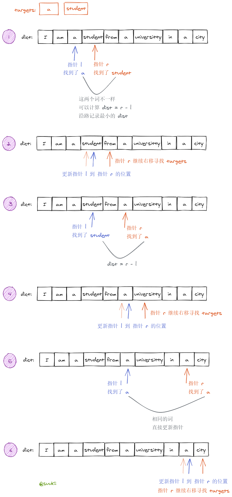
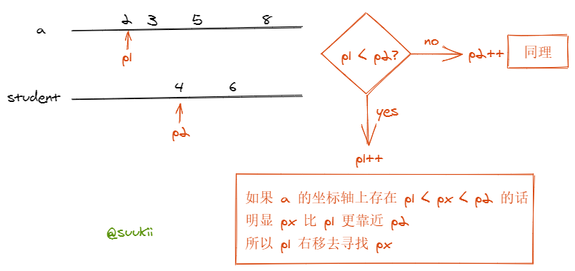

# 面试题 17.11.单词距离

https://leetcode-cn.com/problems/find-closest-lcci

## 题目描述

```
有个内含单词的超大文本文件，给定任意两个单词，找出在这个文件中这两个单词的最短距离(相隔单词数)。如果寻找过程在这个文件中会重复多次，而每次寻找的单词不同，你能对此优化吗?

示例：

输入：words = ["I","am","a","student","from","a","university","in","a","city"], word1 = "a", word2 = "student"
输出：1
提示：

words.length <= 100000

来源：力扣（LeetCode）
链接：https://leetcode-cn.com/problems/find-closest-lcci
著作权归领扣网络所有。商业转载请联系官方授权，非商业转载请注明出处。
```

## 方法 1：双指针

### 思路

使用双指针去找目标词：

- 当 `指针l` 找到 `word1` 时，`指针r` 从 `指针l` 的右边出发去找 `word1` 或者 `word2`；
- 如果 `指针r` 找到了 `word2`，计算距离 `r - l`，同时记录一个最小的距离；
- 如果 `指针r` 找到的还是 `word1`，更新 `指针l` 到 `指针r` 的位置，`指针r` 继续右移寻找；



### 复杂度分析

- 时间复杂度：O(N)，N 为数组长度。
- 空间复杂度：O(1)。

### 代码

JavaScript Code

```js
/**
 * @param {string[]} words
 * @param {string} word1
 * @param {string} word2
 * @return {number}
 */
var findClosest = function (words, word1, word2) {
  const len = words.length
  const foundTarget = (word) => [word1, word2].includes(word)
  const getNext = (cur) => (cur === word1 ? word2 : word1)

  let res = len
  let l = -1,
    r = -1,
    next = ''

  while (r < len) {
    if (foundTarget(words[r])) {
      if (!next) {
        next = getNext(words[r])
      } else if (words[r] === next) {
        r - l < res && (res = r - l)
        next = getNext(next)
      }
      l = r
      r = l + 1
    } else {
      r++
    }
  }
  return res
}
```

## 方法 2：哈希表

### 思路

先用一个哈希表把每个词出现的位置坐标收集起来，再用两个指针分别遍历两个目标词的坐标数组，计算最短距离。

> ps. 下图中 a 和 student 的坐标数组不是题目中的真实结果。



### 复杂度分析

- 时间复杂度：O(N)，N 为数组长度，遍历一次数组记录单词出现位置的时间复杂度 O(N)，遍历两个目标单词的位置数组时间复杂度为 O(N)。
- 空间复杂度：O(N)，N 为数组长度，用了一个哈希表来记录每个单词出现的所有位置。

### 代码

JavaScript Code

```js
/**
 * @param {string[]} words
 * @param {string} word1
 * @param {string} word2
 * @return {number}
 */
var findClosest = function (words, word1, word2) {
  const dict = {}
  words.forEach((w, i) => {
    dict[w] || (dict[w] = [])
    dict[w].push(i)
  })

  const indices1 = dict[word1],
    indices2 = dict[word2]
  let p1 = 0,
    p2 = 0,
    res = words.length

  while (p1 < indices1.length && p2 < indices2.length) {
    res = Math.min(Math.abs(indices2[p2] - indices1[p1]), res)
    indices2[p2] > indices1[p1] ? p1++ : p2++
  }
  return res
}
```

**官方题解**

## 前置知识

- 哈希
- 空间换时间
- 双指针

## 两个数组

### 思路

一个简单的思路是：分别找出 word1 和 word2 在 words 中的所有出现的索引 ids1 和 ids2。于是问题转换为：从两个有序数组分别选一个数，使得二者差的绝对值最小。

## 代码

代码支持: Python

Python Code:

```py
class Solution:
    def findClosest(self, words: List[str], word1: str, word2: str) -> int:
        # [2,5,8]
        ids1 = []
        # [3]
        ids2 = []
        ans = len(words)

        for i in range(len(words)):
            if words[i] == word1:
                ids1.append(i)
            if words[i] == word2:
                ids2.append(i)
        i = j = 0
        while i < len(ids1) and j < len(ids2):
            if ids1[i] < ids2[j]:
                ans = min(ans, ids2[j] - ids1[i])
                i += 1
            else:
                ans = min(ans, ids1[i] - ids2[j])
                j += 1

        return ans
```

**复杂度分析**

- 时间复杂度：$O(N)$，其中 N 为 words 的长度。
- 空间复杂度：$O(N)$，其中 N 为 words 的长度。

## 双指针

### 思路

实际上，上面的数组是没有必要的。我们可以边遍历边计算，从而在 One Pass 内完成，并且只占用常数空间。

### 代码

代码支持: Python, C++

Python Code:

```py
class Solution:
    def findClosest(self, words: List[str], word1: str, word2: str) -> int:
        ans = len(words)
        id1 = id2 = -1
        for i in range(len(words)):
            if words[i] == word1:
                id1 = i
            if words[i] == word2:
                id2 = i
            if id1 != -1 and id2 != -1:
                ans = min(ans, abs(id1 - id2))
        return ans

```

C++ Code:

```C++


class Solution {
    public:
    int findClosest(vector < string > & words, string word1, string word2) {

        int id1 = -1, id2 = -1, ans = words.size()
        for (int i=0
             i < words.size()
             i + +) {
            if (words[i] == word1) id1 = i
            if (words[i] == word2) id2 = i
            if (id1 != -1 && id2 != -1) ans = min(ans, abs(id1 - id2))
        }
        return ans
    }
}
```

**复杂度分析**

- 时间复杂度：$O(N)$，其中 N 为 words 的长度。
- 空间复杂度：$O(1)$

更多题解可以访问我的 LeetCode 题解仓库：https://github.com/azl397985856/leetcode 。 目前已经 30K star 啦。

关注公众号力扣加加，努力用清晰直白的语言还原解题思路，并且有大量图解，手把手教你识别套路，高效刷题。


_Originally posted by @azl397985856 in https://github.com/leetcode-pp/91alg-1/issues/58#issuecomment-651732786_
