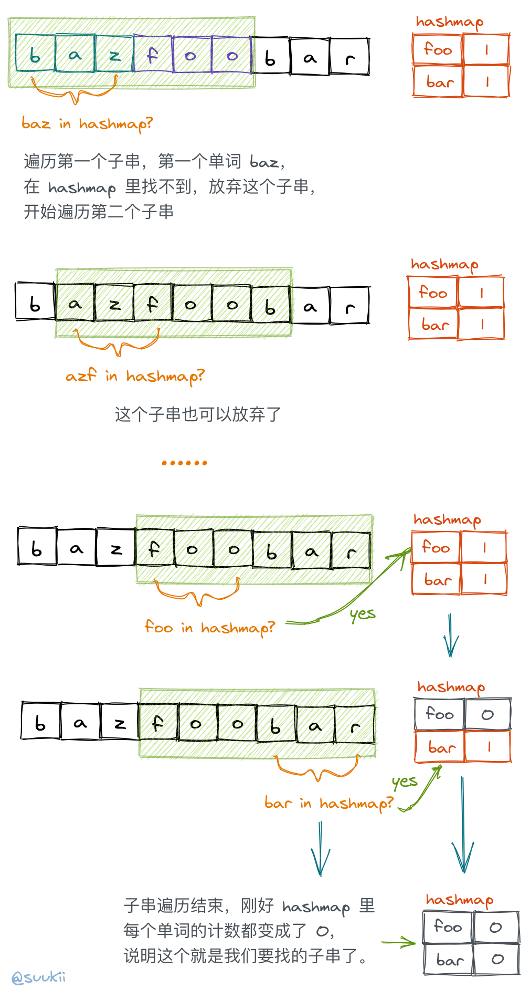

### 思路

naive 的想法是，将 words 里面的单词组合成字符串，然后到 s 里面去找有没有跟它一样的子串。但是，这样子时间复杂度太高了，因为 words 的组合有 `words.length!` 种，总复杂度差不多就是 `s.length * words.length!` 了。

那我们反过来想，s 的子串最多只有 `s.length` 个，那我们只要判断 s 的每个子串是不是刚好由 words 数组里面的所有单词组成的就可以了。所以说，如果子串是刚好匹配 words 的单词的话，说明子串和 words 组成的字符串是两种组合情况，虽然排序不同，但包含的单词种类和数量是一样的。

所以解决方法就很明显了：

- 我们可以用哈希表来记录 words 里面有哪些单词，以及它们分别出现过几次(注意检查每个 s 子串时，哈希表都是新的)。
- 然后开始遍历一个 s 的子串，将它截成一个个单词的长度，去哈希表中查询。
- 如果出现在子串中的单词能在哈希表中找到，就将它的数量 -1，对消掉一个。
- 如果这个单词在哈希表中找不到，或者数量已经变成了 0，就说明这个子串已经不符合我们的要求了，可以停止之后的比较了。
- 如果子串的单词都比较完毕，然后哈希表中所有单词的数量也都刚好变成 0，就说明这个子串就是我们要找的。（这里到判断可以有多种，比如在开始子串比较之前用一个 count 变量来进行计数，如果子串比较结束后 count 刚好等于 words 的长度，就说明找到了符合要求的子串）
- 接着换另一个子串，继续上述步骤。



### 复杂度分析

- 时间复杂度：$(n-k)*k$，n 是字符串 s 的长度，k 是单词的长度。
- 空间复杂度：$m$，m 是 words 数组的长度，哈希表的空间。

### 代码

JavaScript Code

```js
/**
 * @param {string} s
 * @param {string[]} words
 * @return {number[]}
 */
var findSubstring = function(s, words) {
    const wordSize = words[0].length
    const substringLen = wordSize * words.length

    const wordsCount = {}
    words.forEach(w => (wordsCount[w] = (wordsCount[w] || 0) + 1))

    const res = []
    for (let i = 0; i <= s.length - substringLen; i++) {
        const tempCount = {...wordsCount}
        let count = words.length

        for (let j = i; j < i + substringLen; j += wordSize) {
            const word = s.slice(j, j + wordSize)

            if (!(word in tempCount) || tempCount[word] <= 0) break

            tempCount[word]--
            count--
        }

        if (count === 0) res.push(i)
    }
    return res
};
```
