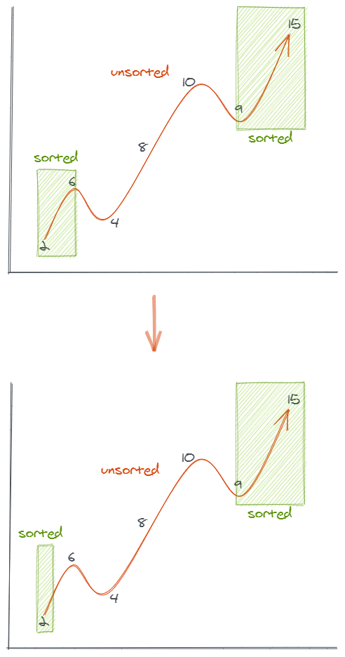

# 581.最短无序连续子数组

https://leetcode-cn.com/problems/shortest-unsorted-continuous-subarray

## 题目描述

```
给定一个整数数组，你需要寻找一个连续的子数组，如果对这个子数组进行升序排序，那么整个数组都会变为升序排序。

你找到的子数组应是最短的，请输出它的长度。

示例 1:

输入: [2, 6, 4, 8, 10, 9, 15]
输出: 5
解释: 你只需要对 [6, 4, 8, 10, 9] 进行升序排序，那么整个表都会变为升序排序。
说明 :

输入的数组长度范围在 [1, 10,000]。
输入的数组可能包含重复元素 ，所以升序的意思是<=。

来源：力扣（LeetCode）
链接：https://leetcode-cn.com/problems/shortest-unsorted-continuous-subarray
著作权归领扣网络所有。商业转载请联系官方授权，非商业转载请注明出处。
```

# 我的回答

## 思路

- 先找出数组两端已经排好序的两个子数组，剩下的中间那段就是**可能的** `最短无序连续子数组`；
- 但由于这个 `无序子数组` 中可能会出现需要插入 `有序子数组` 中的元素，比如图中的数字 4，
- 我们可以把 `无序子数组` 看作一个滑动窗口，当出现了上面出现的这种元素时，就扩大窗口的范围；



## 代码

JavaScript Code

```js
/**
 * @param {number[]} nums
 * @return {number}
 */
var findUnsortedSubarray = function (nums) {
  if (nums.length === 0) return 0

  let l = 0,
    r = nums.length - 1
  while (nums[l + 1] >= nums[l]) l++
  while (nums[r - 1] <= nums[r]) r--

  if (r <= l) return 0

  const unsorted = nums.slice(l, r + 1),
    min = Math.min(...unsorted),
    max = Math.max(...unsorted)

  while (nums[l - 1] > min) l--
  while (nums[r + 1] < max) r++
  return r - l + 1
}
```

JavaScript Code

```js
/**
 * @param {number[]} nums
 * @return {number}
 */
var findUnsortedSubarray = function (nums) {
  if (nums.length === 0) return 0

  let l = 0,
    r = nums.length - 1
  while (nums[l + 1] >= nums[l]) l++
  while (nums[r - 1] <= nums[r]) r--

  if (r <= l) return 0

  let p = l,
    end = r
  while (p <= end) {
    while (nums[p] < nums[l]) l--
    while (nums[p] > nums[r]) r++
    p++
  }
  return r - (l + 1)
}
```

# 参考回答

## 题目地址

[https://leetcode-cn.com/problems/shortest-unsorted-continuous-subarray/](https://leetcode-cn.com/problems/shortest-unsorted-continuous-subarray/)

给定一个整数数组，你需要寻找一个连续的子数组，如果对这个子数组进行升序排序，那么整个数组都会变为升序排序。

你找到的子数组应是最短的，请输出它的长度。

**示例:**
  
输入: [2, 6, 4, 8, 10, 9, 15]
输出: 5
解释: 你只需要对 [6, 4, 8, 10, 9] 进行升序排序，那么整个表都会变为升序排序。

**说明 :**

输入的数组长度范围在 [1, 10,000]。
输入的数组可能包含重复元素 ，所以升序的意思是 <=。

## 前置知识

- 数组排序
- 数组拷贝

## 思路

这道题问的是最长的无序连续子数组 ---> 那最简单的方法就是先排序，将排序过的数组与原数组做一个对比，从最左边的第一个元素开始对比，第一个不相同的元素的下标就是我们需要查找的最长无序连续子数组的初始位置。类似的，我们从最右侧开始向左进行对比，第一个不相同的元素的下标就是我们需要查找的最长无序连续子数组的结束位置。

## 解法

- 将数组复制到一个新的数组并且将新数组进行排序
- 从左到右遍历并对比新旧两个数组，得到第一个不同元素的下标
- 从右到左遍历并对比新旧两个数组，得到第一个不同元素的下标
- 计算两个下标的差值（记得要+1）

这种思路的时间复杂度：$O(nlogn)$，因为最耗时的其实是排序方法。

```javascript
/**
 * @param {number[]} nums
 * @return {number}
 */
var findUnsortedSubarray = function (nums) {
  var arr = nums.slice()
  arr.sort((a, b) => a - b)
  var len = arr.length
  var left, right
  for (var i = 0; i < len; i++) {
    if (arr[i] !== nums[i]) {
      left = i
      break
    }
  }
  for (var i = len - 1; i > -1; i--) {
    if (arr[i] !== nums[i]) {
      right = i
      break
    }
  }

  return left === undefined ? 0 : right - left + 1
}
```

更多题解可以访问我的 LeetCode 题解仓库：https://github.com/azl397985856/leetcode 。 目前已经 30K star 啦。

大家也可以关注我的公众号《力扣加加 sa》获取更多更新鲜的 LeetCode 题解


_Originally posted by @jerkjoe in https://github.com/leetcode-pp/91alg-1/issues/59#issuecomment-653835504_
