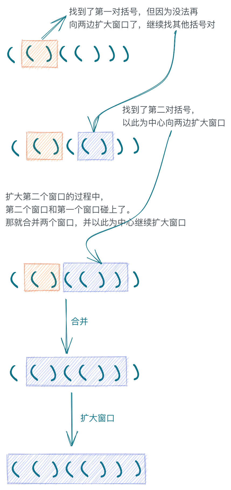
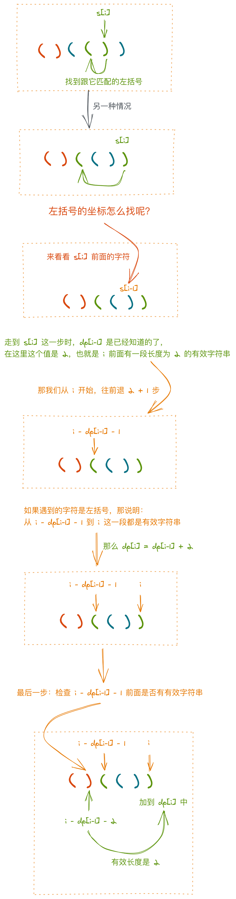

# 有效括号系列

**[20.有效括号](#20.有效括号)**

- [方法 1：栈](#方法-1：栈)
- [方法 2：递归](#方法-2：递归)
- [方法 3：正则](#方法-3：正则)

**[32.最长有效括号](#32.最长有效括号)**

- [方法 1：滑动窗口](#方法-1：滑动窗口)
- [方法 2：动态规划](#方法-2：动态规划)
- [方法 3：栈](#方法-3：栈)

# 20.有效括号

https://leetcode-cn.com/problems/valid-parentheses/

## 题目描述

```
给定一个只包括 '('，')'，'{'，'}'，'['，']' 的字符串，判断字符串是否有效。

有效字符串需满足：

左括号必须用相同类型的右括号闭合。
左括号必须以正确的顺序闭合。
注意空字符串可被认为是有效字符串。

示例 1:

输入: "()"
输出: true
示例 2:

输入: "()[]{}"
输出: true
示例 3:

输入: "(]"
输出: false
示例 4:

输入: "([)]"
输出: false
示例 5:

输入: "{[]}"
输出: true

来源：力扣（LeetCode）
链接：https://leetcode-cn.com/problems/valid-parentheses
著作权归领扣网络所有。商业转载请联系官方授权，非商业转载请注明出处。
```

## 方法 1：栈

### 思路

- 遇到左括号就入栈。
- 遇到右括号就从栈中弹出一个元素，判断两者是否是匹配的一对括号。

### 代码

JavaScript Code

```js
/**
 * @param {string} s
 * @return {boolean}
 */
var isValid = function (s) {
  const dict = {
    '}': '{',
    ')': '(',
    ']': '['
  }
  const stack = []

  for (let c of s) {
    if (c in dict) {
      if (stack.pop() !== dict[c]) {
        return false
      }
    } else {
      stack.push(c)
    }
  }
  return stack.length === 0
}
```

### 复杂度分析

- 时间复杂度：O(n)，n 为字符串的长度。
- 空间复杂度：O(n)，n 为字符串的长度。

## 方法 2：递归

### 思路

还记得[产品经理法](https://github.com/leetcode-pp/91alg-1/issues/32#issuecomment-643620727)么？假设我们现在已经有了一个 `isValid` 方法，可以验证一个字符串 s 是否由有效括号组成。

**那么子问题是什么？**

如果 s 的第一个字符是左括号的话，那我们应该可以找到它对应右括号的下标 index，如果找不到说明就不是有效括号啦。

如果找到了，那么现在问题就变成了：

- (0, index) 中间这段字符串是否包含有效括号？
- (index, s.length) 这段字符串是否包含有效括号？

> 开括号表示不包括边界

**大问题和小问题的关系是什么？**

显然必须两个小问题的结果都是 true 才行啦，也就是：

`isValid(s) = isValid(1, index - 1) && isValid(index + 1, s.length)`

**递归出口在哪里？**

- 如果字符串第一个字符不是左括号，`return false`
- 如果字符串为空，`return true`
- 还有一个，如果字符串长度是奇数的话，我们也可以提前 `return false`。

**关于如何找到对应的右括号下标**

用一个 `counter` 来记录当前遇到的括号，比如，我们要找的是 '(' 的对应右括号 ')'，那么在遍历字符串时：

- 遇到 '(' 时 `counter++`
- 遇到 ')' 时 `counter--`
- 当 `counter === 0` 时说明我们找到了
- 如果遍历结束后 `counter > 0` 说明找不到匹配的右括号

### 代码

JavaScript Code

```js
const dict = {
  '(': ')',
  '{': '}',
  '[': ']'
}

const matchClose = (s, start, end, open, close) => {
  let count = 0
  for (let i = start; i <= end; i++) {
    if (s[i] === open) count++
    if (s[i] === close) count--
    if (count === 0) return i
  }
  return -1
}

/**
 * @param {string} s
 * @return {boolean}
 */
const isValid = function (s) {
  if (!s) return true
  if (s.length % 2 === 1) return false
  if (!(s[0] in dict)) return false

  const closeIndex = matchClose(s, 0, s.length - 1, s[0], dict[s[0]])
  if (closeIndex === -1) return false
  return isValid(s.slice(1, closeIndex)) && isValid(s.slice(closeIndex + 1, s.length))
}
```

### 复杂度分析

- 时间复杂度：O(n _ 2(n/2)，递归的时间复杂度是 O(2^(n/2))，n 为字符串的长度，树的最大深度应该是 n/2 吧。每次递归中 `matchClose` 寻找匹配的闭合括号的时间复杂度大概是 O(n) 吧，所以时间复杂度是 O(n _ 2(n/2) ??? 我凌乱了
- 空间复杂度：O(n)，n 为字符串的长度，调用栈的最大深度是 n/2。

## 方法 3：正则

### 思路

不断地把 `()` `{}` `[]` 替换成空字符，直到：

- s 变成了空字符，那么结果就是 `true`，或者，
- s 长度不为空，但是 s 中已经没有 `()`，`{}` 或者 `[]` 括号对了，那么结果就是 `false`。

### 代码

JavaScript Code

```js
/**
 * @param {string} s
 * @return {boolean}
 */
const isValid = function (s) {
  const reg = /\[\]|\(\)|\{\}/
  while (reg.test(s)) {
    s = s.replace(reg, '')
  }
  return s.length === 0
}
```

### 复杂度分析

- 时间复杂度：O(n)，n 为字符串的长度。最坏的情况下，每次循环只能替换一对括号，比如 "(((((())))))"，需要循环 n/2 次。
- 空间复杂度：O(1)。

# 32.最长有效括号

https://leetcode-cn.com/problems/longest-valid-parentheses/

## 题目描述

```
给定一个只包含 '(' 和 ')' 的字符串，找出最长的包含有效括号的子串的长度。

示例 1:

输入: "(()"
输出: 2
解释: 最长有效括号子串为 "()"
示例 2:

输入: ")()())"
输出: 4
解释: 最长有效括号子串为 "()()"

来源：力扣（LeetCode）
链接：https://leetcode-cn.com/problems/longest-valid-parentheses
著作权归领扣网络所有。商业转载请联系官方授权，非商业转载请注明出处。
```

## 方法 1：滑动窗口

### 思路

1. 首先最短的有效括号字符串就是一对括号 `()`，那我们可以先在字符串 s 中找到这样一对括号。

2. 然后，把这对括号作为一个滑动窗口的中心，分别向左右两侧扩大滑动窗口，窗口内是有效括号。

3. 当滑动窗口不能再扩大时，把当前窗口的左右边界记录下来，然后，从这个窗口的右边界开始，重复步骤 1 到 3，直到字符串遍历结束。

4. 等等，还漏了一种情况。当我们在扩大滑动窗口的时候，如果碰到了另一个窗口的边界，那这两个窗口加起来也是一个有效括号字符串。所以，我们得把这两个窗口作为新的滑动窗口中心，然后向两侧扩大窗口。

5. 因为我们是从左往右遍历字符串，所以窗口相碰的情况只有一种，就是当前窗口的左边界碰到了前一个窗口的右边界，我们只要判断这种情况就行。

### 图解



### 代码

JavaScript Code

```js
/**
 * @param {string} s
 * @return {number}
 */
var longestValidParentheses = function (s) {
  const expand = (s, l, r) => {
    while (s[l - 1] === '(' && s[r + 1] === ')') {
      l--
      r++
    }
    return [l, r]
  }

  const map = {}

  let l = 0,
    r = 0,
    max = 0
  while (true) {
    // 以括号对为中心
    l = s.indexOf('()', r)
    if (l === -1) break

    r = l + 1
    // 向左右两边不断扩大滑动窗口
    ;[l, r] = expand(s, l, r)

    // 当窗口扩大到最大时，
    // 如果当前窗口的左边界刚好挨着前一个窗口的右边界，那么，
    // 合并这两个窗口，再以这个新合并的窗口为中心，向两侧扩大滑动窗口
    while (l - 1 in map) {
      ;[l, r] = expand(s, map[l - 1], r)
    }
    // 记录当前窗口的左右边界，key 是窗口右边界，value 是窗口左边界
    map[r] = l
    // 更新最大窗口
    max = Math.max(max, r - l + 1)
  }

  return max
}
```

### 复杂度分析

- 时间复杂度：O(n)，n 为字符串的长度。
- 空间复杂度：O(n)，n 为字符串的长度。

## 方法 2：动态规划

### 思路

我们可以用一个一维数组 `dp` 来记录 `以当前坐标为结尾的有效括号字符串的长度是多少` 这个状态。

关键是，怎么找到当前坐标的状态 `dp[i]` 跟 `i` 之前坐标的状态的依赖关系。

- 如果当前坐标 i 是一个左括号 '('，很明显有效字符串不会以左括号为结尾，所以这个状态是 0；
- 如果当前坐标 i 是一个右括号 ')'，那么：
  - 如果它前一个 i - 1 是 '('，它们可以组成一对儿，那么 `dp[i]` 至少是 2
  - 如果它前一个 i - 1 是 ')'，虽然它们不能成对儿，但是，')' 说明它可能是某个有效字符串的结尾，那我们就得检查这个坐标 i - 1 的状态了：
    - 如果 `dp[i-1]` 是 0，那就没戏了，`dp[i]` 也只能是 0 了
    - 如果 `dp[i-1] > 0`，那么，i 的前面有一段有效括号字符串，那只要判断这段字符串前面的那个字符是不是 `(` 就好了，如果是，`dp[i] = dp[i-1] + 2`，如果不是，`dp[i] = 0`
  - 等等，还没有结束，如果到了这里，`dp[i]` 大于 0 的话，还有一种情况，跟滑动窗口解法里面的一样，它的左边可能还有一段紧挨着的有效括号字符串，所以我们得把这段字符串的长度也加到 `dp[i]` 中。

### 图解



### 代码

JavaScript Code

```js
/**
 * @param {string} s
 * @return {number}
 */
var longestValidParentheses = function (s) {
  // 状态：以当前字符结尾的字符串，最长的有效括号长度是多大
  const dp = Array(s.length).fill(0)

  for (let i = 1; i < s.length; i++) {
    // 有效括号只能是以 ')' 结尾的
    // 所以，以 '(' 结尾的字符串，最长有效括号长度就是 0，不用管
    if (s[i] === ')') {
      // 遇到 ')' 时，往左边去找跟它匹配的 '('，如果存在，那么有效长度在 dp[i - 1] 基础上加 2

      // dp[i - 1] 是以 s[i - 1] 结尾的字符串的最长有效括号长度，设它为 k，
      // 也就是 [i - k, i - 1] 这段是有效括号字符串，
      // 如果这段字符串前面的那个字符 s[i - k - 1] 是 '(' 的话，那么有效长度加 2
      if (i - dp[i - 1] - 1 >= 0 && s[i - dp[i - 1] - 1] === '(') {
        dp[i] = dp[i - 1] + 2

        // 如果匹配到的 '(' 前面还有有效长度的话，也加上
        if (i - dp[i - 1] - 2 > 0) {
          dp[i] += dp[i - dp[i - 1] - 2]
        }
      }
    }
  }
  return Math.max(...dp, 0)
}
```

### 复杂度分析

- 时间复杂度：O(n)，n 为字符串的长度。
- 空间复杂度：O(n)，n 为字符串的长度。

## 方法 3：栈

### 思路

用一个栈来检查括号的有效性，用一个数组 `valid` 来记录匹配括号对的位置。

- 栈的用法跟[20.有效括号](#方法-1：栈)里的一样，不过入栈的不是 `(`，而是它们的下标。
- 在遍历过程中，如果碰到 `)`，就从栈中弹出一个元素，这个元素就是 `)` 对应的 `(` 的下标。
- 接着我们在 `valid` 中这两个下标对应的位置做个标识 `1`，说明这里找到了一对有效括号。
- 等遍历结束之后，在 `valid` 中找到连续最长的 `1` 序列。

### 代码

JavaScript Code

```js
/**
 * @param {string} s
 * @return {number}
 */
var longestValidParentheses = function (s) {
  const valid = Array(s.length).fill(0)
  const stack = []

  for (let i = 0; i < s.length; i++) {
    if (s[i] === '(') stack.push(i)

    if (s[i] === ')' && stack.length > 0) {
      // Mark the open and close indices as 1 in valid.
      valid[i] = 1
      valid[stack.pop()] = 1
    }
  }

  // Find longest sequence of 1s.
  let count = 0,
    max = 0
  for (let v of valid) {
    v && count++
    v || (count = 0)
    count > max && (max = count)
  }
  return max
}
```

### 复杂度分析

- 时间复杂度：O(n)，n 为字符串的长度。
- 空间复杂度：O(n)，n 为字符串的长度。

## 官方题解

https://github.com/azl397985856/leetcode/blob/master/problems/32.longest-valid-parentheses.md
