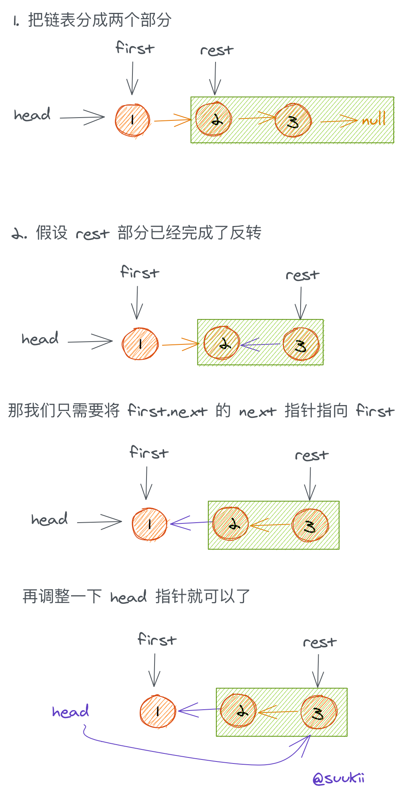
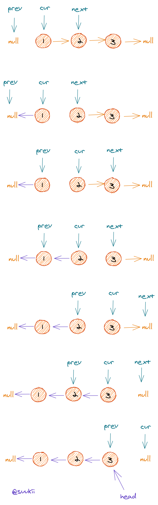

# 反转链表系列

**[206.反转链表](#206.反转链表)**

- [方法 1:递归](#方法-1:递归)
- [方法 2:循环](#方法-2:循环)

**[92.反转链表 II](#92.反转链表II)**

- [方法 1:两趟扫描](#方法-1:两趟扫描)
- [方法 2:一趟扫描](#方法-2:一趟扫描)

**[25.K 个一组翻转链表](#92.25.K个一组翻转链表)**

- [原题](#原题)
- [变形 1](#变形1)
- [变形 2](#变形2)

# 206.反转链表

https://leetcode-cn.com/problems/reverse-linked-list/

## 题目描述

```
反转一个单链表。

示例:

输入: 1->2->3->4->5->NULL
输出: 5->4->3->2->1->NULL
进阶:
你可以迭代或递归地反转链表。你能否用两种方法解决这道题？

来源：力扣（LeetCode）
链接：https://leetcode-cn.com/problems/reverse-linked-list
著作权归领扣网络所有。商业转载请联系官方授权，非商业转载请注明出处。
```

## 方法 1:递归

### 思路

来看看[产品经理法](https://github.com/leetcode-pp/91alg-1/issues/32#issuecomment-643620727)是不是万能的。

> 咦？我是对产品经理法有什么执念吗？

假设我们已经有了一个 `F()` 函数，它的功能就是反转链表，然后返回反转后链表的头部。

**发现子问题**

假设我们有一个链表，这个链表是不是可以分成两个部分：`head` 和 `head.next 到链表尾部`。

那要反转这个链表，是不是可以先把 `head.next 到链表尾部` 这段进行反转，也就是说，要解决 `F(head)`，我们可以先解决 `F(head.next)`。

**发现大问题和小问题的关系**

很简单，只要把反转后的 `head.next 到链表尾部` 这段的最后一个节点指向 `head` 就好了。

但是 `F()` 函数只会返回反转后链表的头部啊，我们怎么知道链表的最后一个节点啊？

在调用 `F(head.next)` 之前先记录一下 `head.next` 就好啦，具体看代码注释吧。

**递归出口**

- 链表最后一个节点：只剩一个节点，直接返回它就好了。
- 空节点。



### 代码

JavaScript Code

```js
/**
 * Definition for singly-linked list.
 * function ListNode(val) {
 *     this.val = val;
 *     this.next = null;
 * }
 */
/**
 * @param {ListNode} head
 * @return {ListNode}
 */
var reverseList = function (head) {
  // 递归出口
  if (!head || !head.next) return head

  // 进行反转下一段链表之前，
  // 先把这段链表的第一个节点记录一下
  // 链表反转结束后，这就变成最后一个节点了
  const lastNode = head.next

  // 反转余下的链表
  // reverseList 函数会返回反转后链表的头部
  const newHead = reverseList(head.next)

  // 将反转后链表的尾部指向当前节点
  lastNode.next = head
  head.next = null
  // 返回新头部
  return newHead
}
```

## 方法 2:循环

### 思路

1. 初始化一个 `prev` 指针为 null，一个 `cur` 指针为 head；
2. 开始遍历链表，在每一次循环中：

- 先保存 `cur.next`；
- 把 `cur.next` 倒转方向指向 `prev`；
- `prev` 和 `cur` 都分别往前一步；

### 图解



### 代码

```py
# Definition for singly-linked list.
# class ListNode(object):
#     def __init__(self, x):
#         self.val = x
#         self.next = None

class Solution(object):
    def reverseList(self, head):
        """
        :type head: ListNode
        :rtype: ListNode
        """
        prev, cur = None, head
        while cur != None:
            nextNode = cur.next
            cur.next = prev
            prev = cur
            cur = nextNode
        return prev
```

# 92.反转链表 II

https://leetcode-cn.com/problems/reverse-linked-list-ii/

## 题目描述

```
反转从位置 m 到 n 的链表。请使用一趟扫描完成反转。

说明:
1 ≤ m ≤ n ≤ 链表长度。

示例:

输入: 1->2->3->4->5->NULL, m = 2, n = 4
输出: 1->4->3->2->5->NULL

来源：力扣（LeetCode）
链接：https://leetcode-cn.com/problems/reverse-linked-list-ii
著作权归领扣网络所有。商业转载请联系官方授权，非商业转载请注明出处。
```

## 方法 1:两趟扫描

### 思路

比较直白的思路：

- 第一趟扫描先找到需要反转的链表片段的头尾，
- 然后再扫描一遍将这个片段进行反转，
- 最后将反转后的片段和原链表的头尾两段拼接起来就好。

思路很简单，就是各种指针有点绕，具体看代码吧。

### 代码

JavaScript Code

```js
/**
 * Definition for singly-linked list.
 * function ListNode(val) {
 *     this.val = val;
 *     this.next = null;
 * }
 */
/**
 * @param {ListNode} head
 * @param {number} m
 * @param {number} n
 * @return {ListNode}
 */
var reverseBetween = function (head, m, n) {
  if (!head || !head.next) return head

  let startPrev = null, // 第 m-1 个节点
    start = null, // 第 m 个节点
    end = null, // 第 n 个节点
    endNext = null, // 第 n+1 个节点
    cur = head

  // 第一趟扫描
  // 分别找到上述节点
  let i = 1
  while (cur && i <= n) {
    if (i < m) {
      startPrev = cur
    }
    if (i === m) {
      start = cur
    }
    if (i === n) {
      end = cur
      endNext = cur.next
    }
    cur = cur.next
    i++
  }

  // 将 m -> n 这段链表进行反转
  // reverseList 可以用循环实现，具体看 206 题
  end.next = null
  end = reverseList(start)

  // 如果反转不是从第一个节点开始的话
  // 将反转后的片段和原链表左边的那段拼接起来
  if (startPrev) {
    startPrev.next = end
  }
  // 如果反转是从第一个节点开始的话
  // 把 head 指针指向反转后片段的第一个节点
  else {
    head = end
  }
  // 将反转后的片段和原链表右边的那段拼接起来
  start.next = endNext
  return head
}

/**
 * @param {ListNode} head
 * @return {ListNode}
 */
var reverseList = function (head) {
  if (!head || !head.next) return head
  const lastNode = head.next
  const newHead = reverseList(head.next)
  lastNode.next = head
  head.next = null
  return newHead
}
```

## 方法 2:一趟扫描

### 思路

从第 `m` 个节点开始，不断地把这个节点的 `next` 拿出来，插到第 `m-1` 个节点后面，直到第 `n-1` 个节点，结束操作。

思路很简单，就是链表的删除和插入操作，画个图就比较好理解了。

> tips: 用一个 dummy 节点来简化操作，这样就不用分开考虑 m 等于 1 和不等于 1 的情况了。

### 代码

JavaScript Code

```js
/**
 * Definition for singly-linked list.
 * function ListNode(val) {
 *     this.val = val;
 *     this.next = null;
 * }
 */
/**
 * @param {ListNode} head
 * @param {number} m
 * @param {number} n
 * @return {ListNode}
 */
var reverseBetween = function (head, m, n) {
  if (!head || !head.next) return head

  const dummy = new ListNode(null)
  dummy.next = head

  let prev = dummy,
    cur = prev.next

  let i = 0
  while (i < n - 1) {
    i++

    // prev 是反转片段前的一个节点
    if (i === m - 1) {
      prev = cur
    }
    if (i < m) {
      cur = cur.next
    }

    // 在 [m, n) 这段区间里
    // 把 cur 的下一个节点从链表中删掉
    // 再插入到 prev 后面去
    if (i >= m) {
      temp = cur.next
      cur.next = temp.next
      temp.next = prev.next
      prev.next = temp
    }
  }
  return dummy.next
}
```

# 25.K 个一组翻转链表

https://leetcode-cn.com/problems/reverse-nodes-in-k-group/

## 题目描述

```
给你一个链表，每 k 个节点一组进行翻转，请你返回翻转后的链表。

k 是一个正整数，它的值小于或等于链表的长度。

如果节点总数不是 k 的整数倍，那么请将最后剩余的节点保持原有顺序。

 

示例：

给你这个链表：1->2->3->4->5

当 k = 2 时，应当返回: 2->1->4->3->5

当 k = 3 时，应当返回: 3->2->1->4->5

 

说明：

你的算法只能使用常数的额外空间。
你不能只是单纯的改变节点内部的值，而是需要实际进行节点交换。

来源：力扣（LeetCode）
链接：https://leetcode-cn.com/problems/reverse-nodes-in-k-group
著作权归领扣网络所有。商业转载请联系官方授权，非商业转载请注明出处。
```

## 原题

### 思路

遍历链表，用一个计数器 `i` 来记录当前是第几个节点，当 `i` 等于 `k` 的倍数时，将 `i` 之前的这段链表进行反转，也就是调用一下 `reverseBetween(ithNode, i - k + 1, i)` 就行，把反转后的链表插回原来的位置，然后继续遍历。

### 代码

JavaScript Code

```js
// 不想写
```

## 变形 1

### 题目修改

```
将原题中

“如果节点总数不是 k 的整数倍，那么请将最后剩余的节点保持原有顺序”

改为：

“如果节点总数不是 k 的整数倍，那么请将最前面剩余的节点保持原有顺序”
```

### 思路

先遍历一次链表找到剩余节点的个数(用一个 counter 记录，数到 k 就归零)，也就是 `len % k`，然后从第 `len % k + 1` 个节点进行 k 个一组的反转。

### 代码

JavaScript Code

```js
// 不想写
```

## 变形 2

### 题目修改

```
将原题中

“如果节点总数不是 k 的整数倍，那么请将最后剩余的节点保持原有顺序”

改为：

“如果节点总数不是 k 的整数倍，那么请将最后剩余的节点作为一组进行反转”
```

### 思路

跟[92.反转链表 II](#方法2:一趟扫描)的思路有点像，都是反转链表中的一段，不过这题是以 `K` 个节点为一组地反转。

大概思路是，用一个计数器 `i` 记录当前是第几个节点，如果 `i` 是 0 或者 `K` 的倍数的话，说明接下来的 `K` 个节点是一组，对它们进行反转操作就行。

### 代码

JavaScript Code

```js
/**
 * Definition for singly-linked list.
 * function ListNode(val) {
 *     this.val = val;
 *     this.next = null;
 * }
 */
/**
 * @param {ListNode} head
 * @param {number} k
 * @return {ListNode}
 */
var reverseKGroup = function (head, k) {
  if (!head || !head.next || k <= 1) return head

  const dummy = new ListNode(null)
  dummy.next = head

  let prev = dummy,
    cur = prev.next

  let i = 0
  while (cur) {
    i++
    if (i % k === 0) {
      prev = cur
      cur = prev.next
    }
    if (!cur || !cur.next) break

    const temp = cur.next
    cur.next = temp.next
    temp.next = prev.next
    prev.next = temp
  }
  return dummy.next
}
```

**官方题解**
